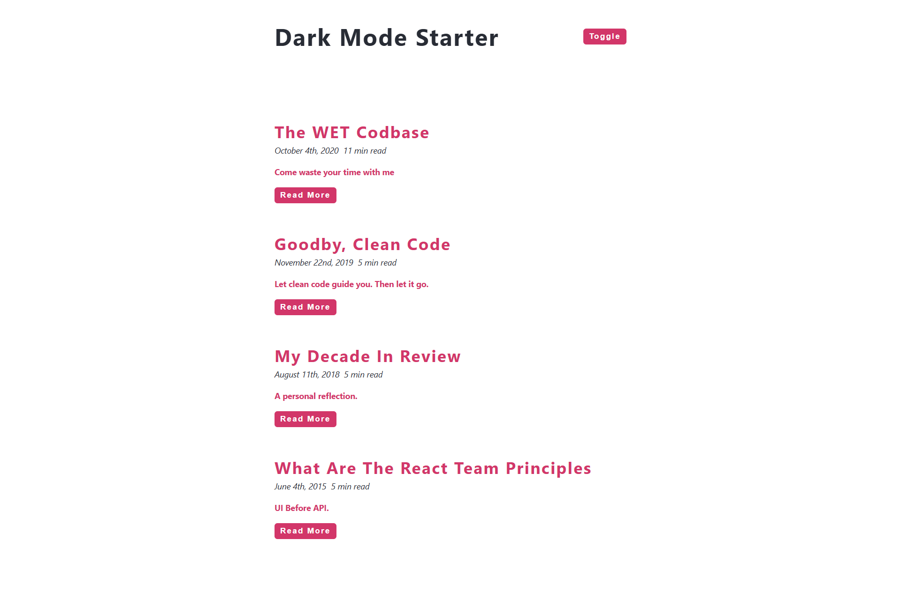
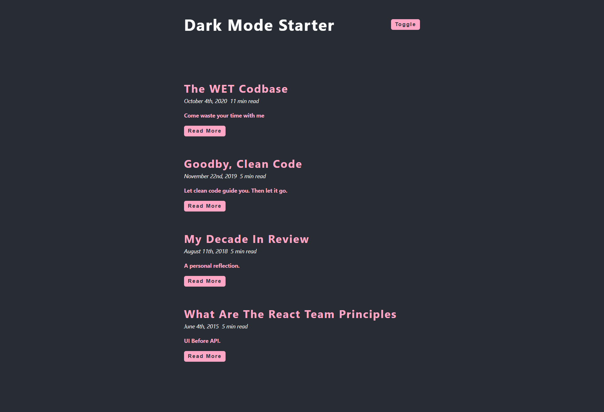

# Dark Mode React App

A clean and interactive React application that demonstrates how to implement a seamless dark mode feature with theme persistence.

## Features

- **Theme Support**: Seamlessly toggle between light and dark modes with a single click.
- **Persistent State**: Remembers your theme preference across browser sessions.
- **Responsive Design**: Fully optimized for mobile, tablet, and desktop screens.
- **Modern UI**: Clean and intuitive user interface built with accessibility in mind.
- **Date Handling**: Integrated with Moment.js for professional date formatting.

## Screenshots

| Light Theme | Dark Theme |
| :---: | :---: |
|  |  |

## Tech Stack

- **Frontend**: React (Hooks, Context API)
- **Time/Date**: [Moment.js](https://momentjs.com/)
- **Styling**: Vanilla CSS
- **Icons**: Font Awesome / React Icons

## Getting Started

### Prerequisites

- Node.js (v14 or higher)
- npm or yarn

### Installation

1. Clone the repository:
   ```bash
   git clone https://github.com/aadhar41/dark-mode.git
   ```

2. Navigate to the project directory:
   ```bash
   cd dark-mode
   ```

3. Install dependencies:
   ```bash
   npm install
   ```

4. Start the development server:
   ```bash
   npm start
   ```

## Contributing

Contributions are welcome! Please read [CONTRIBUTING.md](CONTRIBUTING.md) for more details.

## License

This project is licensed under the MIT License - see the [LICENSE](LICENSE) file for details.

## Author

**Aadhar Gaur**

- [LinkedIn](https://www.linkedin.com/in/aadhar-gaur-php/)
- [GitHub](https://github.com/aadhar41)
